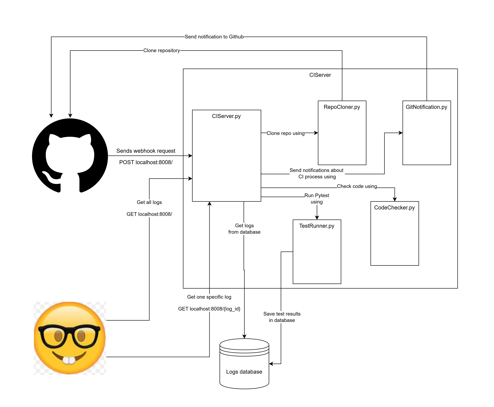

# DD2480-CI

## Project Structure
```
DD2480-CI/
├── src/
│   ├── app/                    # Main application code
│   │   ├── CIServer.py        # Core CI server implementation
│   │   ├── clone.py           # Repository cloning functionality
│   │   ├── notify.py          # GitHub status notification system
│   │   ├── runTests.py        # Test execution handler
│   │   ├── syntax_check.py    # Python syntax validation
│   │   └── main.py           # Server entry point
│   └── test/                  # Test suite
│       └── CIServer_test.py   # Comprehensive tests for CI server
├── .github/                   # GitHub specific configurations
│   └── workflows/             # GitHub Actions workflows
└── venv/                     # Python virtual environment
```
## Project Structure Diagram
Here is a diagram that illustrates the project structure:


## Key Components

**CI Server (CIServer.py)**
- Core server implementation handling webhook requests from GitHub
- Orchestrates the entire CI pipeline including cloning, syntax checking, and test execution
- Manages GitHub status updates for each stage of the pipeline

**Repository Management (clone.py)**
- Handles secure cloning of repositories
- Creates and manages temporary directories for repository processing
- Ensures proper cleanup after CI operations

**Notification System (notify.py)**
- Implements GitHub status API integration
- Updates commit statuses for syntax checks and test results
- Provides real-time feedback on CI pipeline stages

**Code Quality Tools**
- Syntax Checker (syntax_check.py)
- Performs Python syntax validation using Pylint
- Identifies syntax errors and undefined variables
- Generates detailed error reports

**Test Runner (runTests.py)**
- Executes pytest-based test suites
- Reports test results back to the CI pipeline

**Testing Framework**
- Comprehensive test suite covering all major components
- Includes mocked tests for GitHub interactions
- Tests for success and failure scenarios of the CI pipeline
- Network error handling and edge case coverage

## Setup - Not using docker
Install Python 3.13.1

1. When you have installed python, Use the following command to create a virtual environment:

```bash
python3 -m venv venv
```

2. To enter virtual environment

    To enter virtual environment (For MacOS), run:

    ```bash
    source venv/bin/activate
    ```

    To enter virtual environment (For Windows), run:

    ```bash
    .\venv\Scripts\activate
    ```
    
    In the virutal environment run the following command to install all necessary dependencies_

    ```pip install -r requirements.txt```

    - Use command ```deactivate``` to close environment
3. Create a Github personal access token
4. Add .env file to Root directory of the project
    - Add the following line to the .env file:

    ```GITHUB_TOKEN=your personal access token here```
## Expose your local host
1. Open ngrok tunnel
    ```ngrok http http://localhost:8008```
    - OBS! port needs to be 8008
2. Add the ngrok URL to a github webhook that can recieve push events


## Running the program

1. To run server, use following command:

```bash
python src/app/main.py
```

2. To run tests run the following command:
```bash
pytest src/test/CIServer_test.py
```

## Run Server with docker image
### Build the container
```bash
docker build . -t {nameofimage}
```
### Running server
```bash
docker run -e GITHUB_TOKEN={your_github_token_here} -p 8008:8008 {name of image}
```

## Statement of contributions

### Felicia Murkes:
- Setup HTTP server
- Setup docker image
- Bugfixes on all three core features
- Connected all features
- Made some tests for do_post, clonechecker and syntax check
- Some fixes to broken tests
- Added two get endpoints to view the log history

### Eyüp Ahmet Başaran
- Implemented core feature 1
- Fixes related to tmp directory management
- Notification tests

### Bingjie Zhao
- Implemented core feature three
- Tests for notify() function
- fixed bugs in CIServer related to commit status;

### Ismail 
- Implemeted database
- Tests for syntax check

### Melissa Saber
- Implemented core feature 2
- wrote documatation for functions

## How we used git

## Our way of working (SEMAT)
